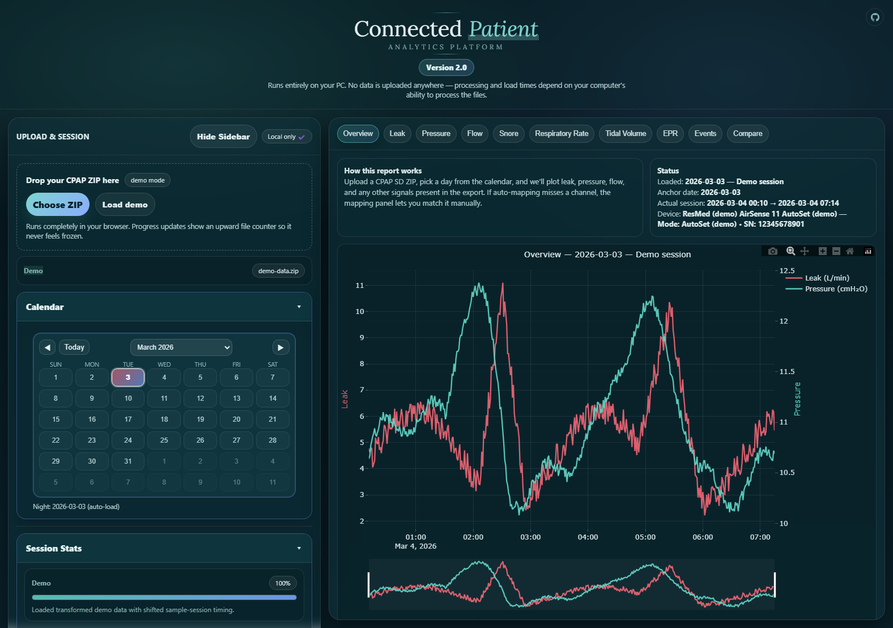
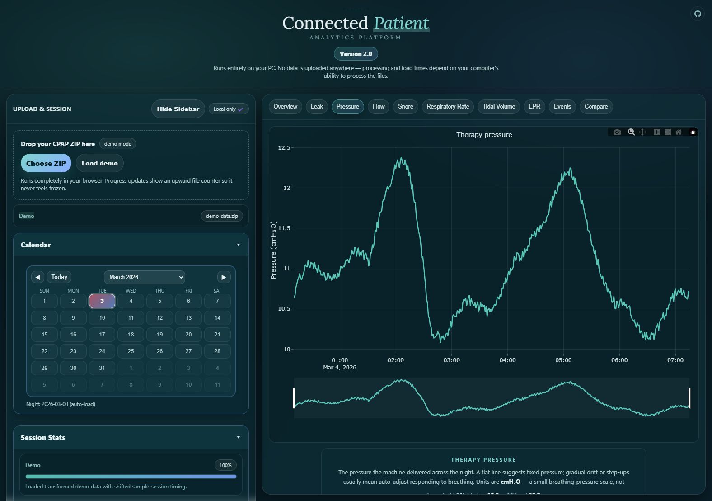
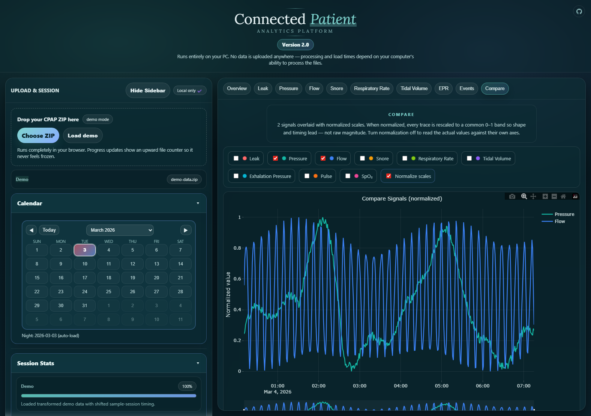
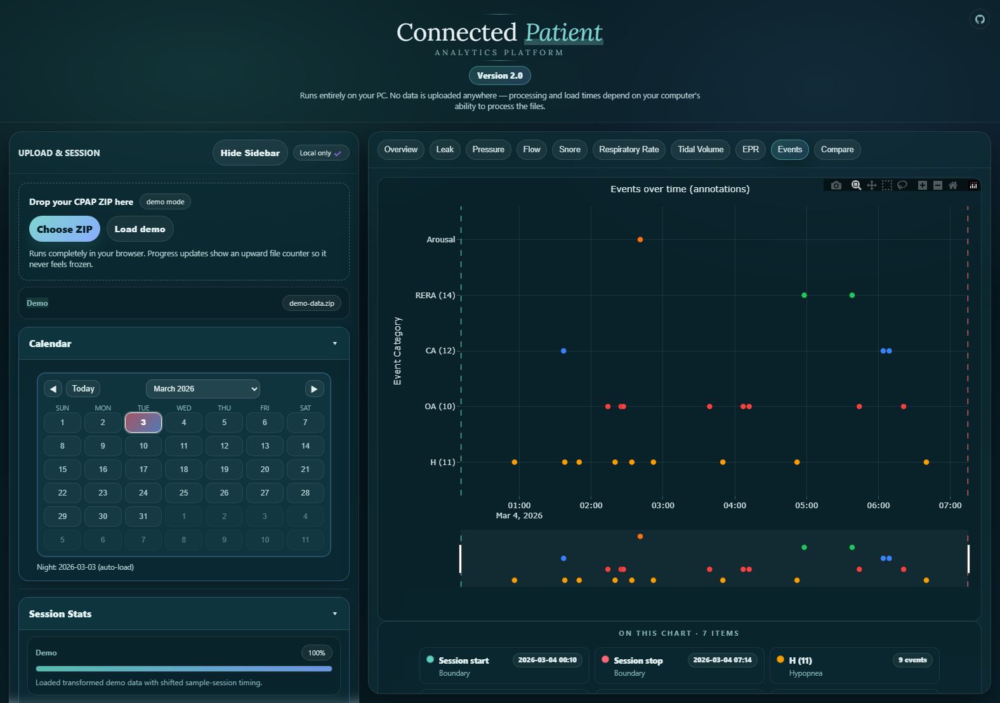

# Connected Patient Analytics Platform

A local-only browser app for opening CPAP SD-card ZIP exports, picking one anchored night at a time, and reading the results as plain-language charts — without uploading anything anywhere.

**Version 2.0** · Tested on ResMed AirSense 11.

<p align="center">
  
  
</p>
<p align="center">
  
  
</p>

Screenshots come from the built-in demo mode. They are not real patient data.

## What It Does

- Opens CPAP SD-card ZIP exports directly in your browser.
- Runs entirely locally — no backend, no account, no cloud upload. Load times depend on your own computer.
- Anchors the calendar to raw `DATALOG/YYYYMMDD` folder dates, then loads the full detected night for that anchor.
- Plots leak, therapy pressure, flow, snore, respiratory rate, tidal volume, exhalation pressure, events, and custom signal overlays.
- Ships as one self-contained file: `CPAP.html`.

## Using Your Own ZIP

This app expects a ZIP made from the root of a CPAP SD-card copy.

1. Power off the CPAP device and safely remove the SD card.
2. Copy the full card contents into a folder on your computer.
3. Optional: trim older day folders from `DATALOG/` to make a smaller archive.
4. Create one `.zip` from that folder.
5. Open `CPAP.html` and load the ZIP.

The app reads the archive in your browser, inventories what it finds, and builds a nightly view from the EDF data already inside.

## Demo Mode

The built-in demo embeds five transformed sessions generated from a sample archive.

- `Load demo` randomly picks one of the five.
- Refreshing re-rolls in normal demo mode.
- Demo identifiers, dates, and chart values are all shifted before display. The demo serial uses a same-length fake sequence, not the real one.

For documentation and screenshots, a pinned demo-set override is available via URL hash:

```text
#demo=1&demoSet=1&skipOnboarding=1&tab=overview
```

That keeps a chosen demo set stable so screenshots stay reproducible.

## Tabs

- **Overview** — leak vs pressure at a glance for the selected night.
- **Leak** — mask-seal behavior and time above the large-leak guide line.
- **Pressure** — therapy pressure across the detected session.
- **Flow** — breathing waveform, shape changes, pauses.
- **Snore** — vibration-based snore activity signal.
- **Respiratory Rate** — breaths per minute over time.
- **Tidal Volume** — air moved per breath, with male/female baseline reference lines.
- **EPR** — therapy vs exhalation pressure, with derived relief.
- **Events** — parsed annotations, deduplicated per event code, with session-boundary markers and a full glossary.
- **Compare** — overlay several signals on a single plot, normalized or raw.

Advanced detail (source inventory, mappings, EDF headers, debug log) lives in the collapsed drawers at the bottom of the left sidebar.

## EPR Interpretation

This app treats `EprPress.2s` as absolute exhalation pressure, not as the `0–3` comfort setting itself.

That means values like `4–7 cmH₂O` can be valid — they are still real pressure values during exhale. The relief amount is derived from the difference between therapy pressure and exhalation pressure. `CurrentSettings.json` is used only as a cross-check.

## Privacy and Scope

- Runs locally in your browser. No data leaves your computer.
- Tested only on ResMed AirSense 11 SD exports. Other devices may load partially or not at all.
- Intended for exploration and curiosity, not diagnosis or treatment.
- Not medical advice. Not a clinical tool. Do not rely on it for treatment decisions.

## Screenshot Refresh

The capture script pins demo set `1` so the gallery stays reproducible:

```powershell
powershell -ExecutionPolicy Bypass -File scripts\capture-marketing-screenshots.ps1
```

That refreshes the four `cpap-*.png` files in `assets/`.
