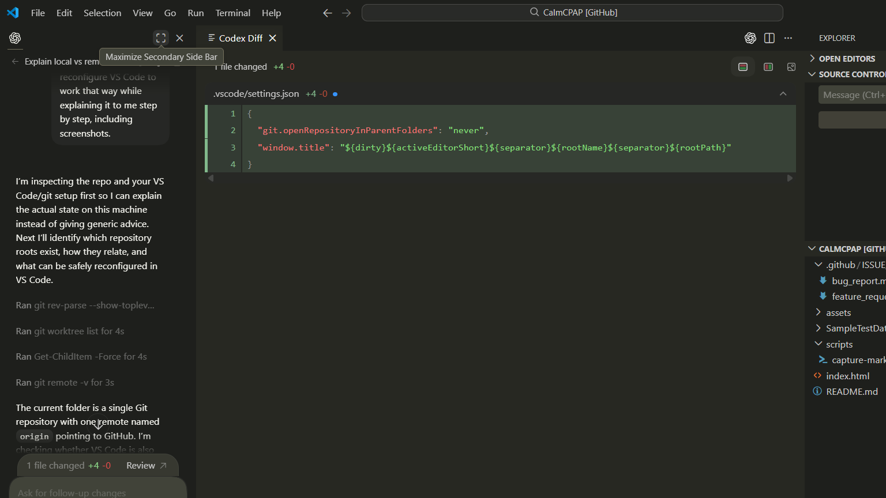
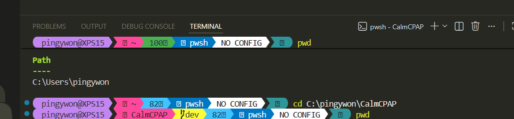
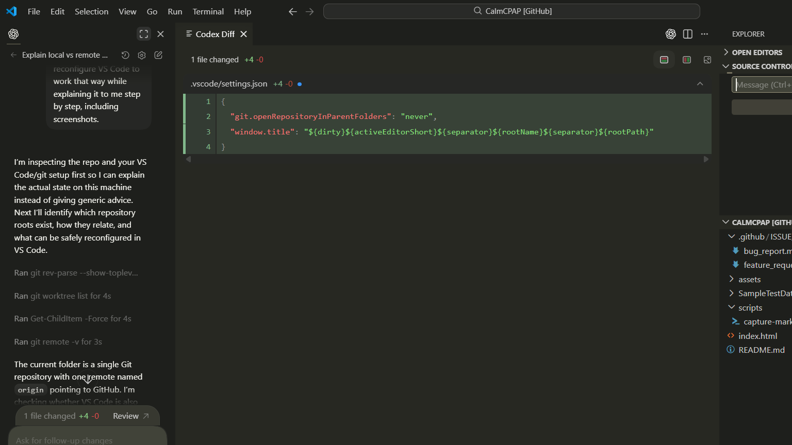

# VS Code and Git Setup for CalmCPAP

## What exists on this machine

You currently have these separate things:

1. Local Git repo for this project: `C:\pingywon\CalmCPAP`
2. Remote Git repo on GitHub: `https://github.com/pingywon/CalmCPAP.git`
3. Another unrelated local Git repo: `C:\pingywon\anduril`
4. A VS Code GitHub-integrated view that was showing `CalmCPAP [GitHub]`

The important distinction is this:

- The **local repo** is the copy on your disk where you should normally edit files, run code, commit, and test.
- The **remote repo** is the copy on GitHub that you fetch from and push to.
- The **GitHub VS Code view** is useful for browsing, but it should not be your normal working copy for day-to-day development.

Git is a distributed version control system, so a clone on your machine is not a cache. It is a full repository with its own history, branches, and commits.

## What I verified

- `git rev-parse --show-toplevel` returned `C:/pingywon/CalmCPAP`
- `git remote -v` shows `origin` pointing at `https://github.com/pingywon/CalmCPAP.git`
- `git worktree list` shows one local worktree at `C:/pingywon/CalmCPAP`
- There is a second separate repo at `C:\pingywon\anduril`, which is not part of CalmCPAP

## Which repository you should work in

For CalmCPAP, work in:

`C:\pingywon\CalmCPAP`

That is the actual local clone of the project.

Use the GitHub remote only as the upstream copy:

- pull or fetch from it to get updates
- push to it when you want your local commits published

## How you should use it

Use this routine:

1. In VS Code, open the local folder `C:\pingywon\CalmCPAP`
2. Make your edits locally
3. Review changes in Source Control
4. Commit locally
5. Push to `origin` on GitHub when ready

If you ever see a VS Code window that looks like a GitHub-browsing view, use it as a reference view only. For real work, reopen the local folder and continue there.

## What I changed in VS Code

I added this workspace setting file:

`C:\pingywon\CalmCPAP\.vscode\settings.json`

It contains:

```json
{
  "git.openRepositoryInParentFolders": "never",
  "window.title": "${dirty}${activeEditorShort}${separator}${rootName}${separator}${rootPath}"
}
```

What those settings do:

- `git.openRepositoryInParentFolders: "never"` keeps VS Code from walking upward and attaching to parent Git repos when this project is open
- `window.title` makes the local folder path available in the window title when the folder is opened locally

I also reopened VS Code on the local CalmCPAP folder instead of leaving it in the GitHub-style view.

## Step by step

### 1. Open the local folder, not the GitHub view

In VS Code, use:

`File` -> `Open Folder...`

Then choose:

`C:\pingywon\CalmCPAP`

This is the folder you should use for normal development.

### 2. Confirm you are in the right project

You should see the local project files in Explorer, including `.git`, `assets`, `scripts`, `index.html`, and `README.md`.



### 3. Confirm the terminal/session is attached to CalmCPAP

Open the integrated terminal. The terminal tab should be for CalmCPAP, and when you `cd` into the repo the prompt reflects that project.



### 4. Use Source Control from the local repo

Open the Source Control view and review changes there before committing.

Your working loop is:

- edit files
- stage what you want
- write a commit message
- commit
- push to GitHub



## Practical rule

If you are developing CalmCPAP, the folder to trust is:

`C:\pingywon\CalmCPAP`

If you are browsing GitHub in VS Code, treat that as read-mostly context, not your main workspace.
